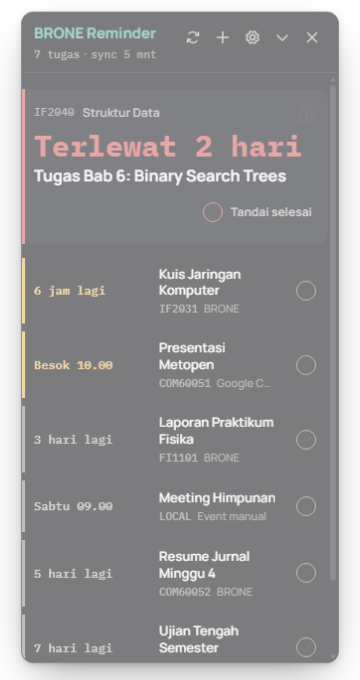
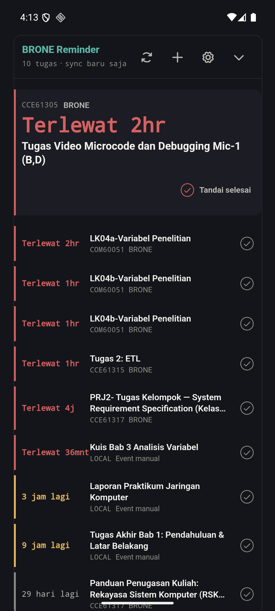
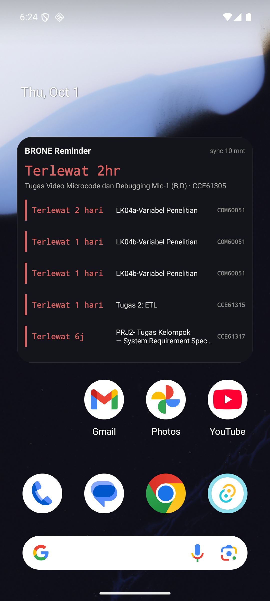

# 📅 BRONE Reminder Widget

[](https://github.com/Zxaviers/reminder-widget/releases/tag/v1.0.0)
[](https://github.com/Zxaviers/reminder-widget/releases/latest)
[](https://github.com/Zxaviers/reminder-widget/actions/workflows/ci.yml)
[](LICENSE)
[](test/)

> **BRONE Reminder Widget** is a lightweight, distraction-free deadline tracker for UB Moodle (BRONE) and Google Calendar, built on Tauri v2.  
> Available as a floating always-on-top or wallpaper-pinned desktop widget on Windows 10/11, and as an Android app with interactive homescreen widget support.  
> Operates with zero telemetry, direct-to-source HTTP connections, and safe local storage.

---

Widget pengingat tenggat waktu tugas akademik Moodle ([BRONE Universitas Brawijaya](https://brone.ub.ac.id/)) dan Google Calendar yang ringkas, elegan, dan hemat daya. Menampilkan daftar tugas terdekat langsung di layar desktop atau homescreen ponsel Anda tanpa perlu membuka peramban secara terus-menerus.

<p align="center">
  
  &nbsp;
  
  &nbsp;
  
</p>

---

## ✨ Fitur Utama (Feature Matrix)

| Fitur / Kemampuan | Windows Desktop (v1.0.0) | Android (Preview) | Deskripsi & Catatan |
|---|:---:|:---:|---|
| **Daftar Tugas Terdekat** | ✅ | ✅ | Daftar terurut tenggat waktu terdekat, indikator warna urgensi (merah: lewat batas, kuning: < 24 jam). |
| **Tandai Selesai (Mark Done)** | ✅ | ✅ | Sembunyikan tugas yang sudah dikerjakan seketika dengan bilah **Urungkan (Undo)** 6 detik. |
| **Pemulihan Tugas (Restore)** | ✅ | ✅ | Seksi *Selesai* untuk mengembalikan tugas yang tidak sengaja ditandai selesai. |
| **Dukungan Multi-Feed** | — | ✅ | Hubungkan lebih dari satu kalender sekaligus (BRONE + Google Calendar + iCal eksternal). |
| **Google Calendar (.ics)** | — | ✅ | Sinkronisasi tenggat waktu via URL kalender rahasia berekstensi `.ics`. |
| **Event Manual Offline** | — | ✅ | Tambahkan deadline tugas mandiri atau agenda lokal yang disimpan langsung di perangkat. |
| **Mode Tampilan Ganda** | ✅ | — | Pilihan mode melayang (*Always-on-Top*) atau menempel di wallpaper desktop (`HWND_BOTTOM`). |
| **Widget Homescreen** | — | ✅ | Android AppWidget 6 baris interaktif dengan scrolling vertikal langsung di layar beranda. |
| **Pilihan Tema Visual** | Gelap murni | Gelap / Terang / Auto | Mendukung tema Gelap (*Dark*), Terang (*Light*), atau Otomatis mengikuti pengaturan sistem operasi. |
| **Notifikasi Alarm** | ✅ | ✅ | Notifikasi toast / sistem menjelang tenggat waktu (ambang batas default: 24j, 6j, 1j). |
| **Deteksi Submit Otomatis** | ✅ | — | Pengecekan status "Submitted for grading" di latar belakang via sesi login BRONE (hemat kuota & sopan). |
| **Penyimpanan Kredensial Aman** | Windows Credential Manager | Penyimpanan Privat App | Windows via `keyring` (terenkripsi DPAPI OS); Android di sandbox privat aplikasi ([#5](https://github.com/Zxaviers/reminder-widget/issues/5)). |
| **Integrasi System Tray** | ✅ | — | Ikon tray Windows lengkap: toggle widget, refresh sekarang, buka folder konfigurasi, dsb. |
| **Instance Tunggal** | ✅ | ✅ | Membuka aplikasi berulang kali akan memfokuskan jendela yang sudah aktif (*single-instance*). |

---

## 📦 Unduh & Pasang (Downloads)

> [!NOTE]
> **Status Platform**: Versi rilis untuk desktop Windows tetap dipertahankan pada **v1.0.0** (versi stabil resmi). Pembaruan multi-feed dan fitur Android diterbitkan melalui rilis terbaru.

| Berkas | Platform | Status Rilis | Ukuran | Deskripsi |
|---|---|---|---|---|
| [`Reminder.Widget.1.0.0.Setup.exe`](https://github.com/Zxaviers/reminder-widget/releases/download/v1.0.0/Reminder.Widget.1.0.0.Setup.exe) | Windows 10/11 (x64) | **Stabil (v1.0.0)** | ~3.8 MB | Installer resmi NSIS (Start Menu, tray, autostart) |
| [`Reminder.Widget.1.0.0.exe`](https://github.com/Zxaviers/reminder-widget/releases/download/v1.0.0/Reminder.Widget.1.0.0.exe) | Windows 10/11 (x64) | **Stabil (v1.0.0)** | ~16.2 MB | Biner portabel mandiri (langsung jalan tanpa instalasi) |
| [`BRONE-Reminder-arm64.apk`](https://github.com/Zxaviers/reminder-widget/releases/latest/download/BRONE-Reminder-arm64.apk) | Android 7.0+ (`arm64-v8a`) | **Rilis Terbaru** | ~9.8 MB | Paket aplikasi mandiri Android arsitektur 64-bit |

### Panduan Instalasi & Keamanan

#### Windows SmartScreen
Biner desktop Windows belum ditandatangani sertifikat digital komersial berbayar (EV Code Signing). Jika Windows SmartScreen menampilkan layar biru perlindungan (*"Windows protected your PC"*):
1. Klik **More info** (*Informasi selengkapnya*).
2. Klik tombol **Run anyway** (*Tetap jalankan*).

#### Memasang APK Android
1. Unduh `BRONE-Reminder-arm64.apk` ke perangkat HP Android Anda.
2. Buka berkas APK melalui browser atau pengelola berkas (*File Manager*).
3. Jika muncul dialog perizinan, aktifkan opsi **Install unknown apps** (*Pasang aplikasi tidak dikenal*).
4. Anda juga dapat memasang via ADB dari komputer pengembang:
   ```bash
   adb install -r BRONE-Reminder-arm64.apk
   ```

#### Verifikasi Integritas Checksum (SHA-256)
- **Windows (PowerShell)**:
  ```powershell
  Get-FileHash .\Reminder.Widget.1.0.0.Setup.exe -Algorithm SHA256
  ```
- **Android (Linux / macOS)**:
  ```bash
  curl -sL https://github.com/Zxaviers/reminder-widget/releases/latest/download/SHA256SUMS.txt | sha256sum -c -
  ```

---

## ⚙️ Menghubungkan Kalender (Connect Feeds)

### 1. Ekspor Kalender BRONE (Moodle UB)
1. Buka dan masuk ke portal **[BRONE UB](https://brone.ub.ac.id/)**.
2. Masuk ke menu **Calendar** &rarr; **Export calendar**.
3. Pilih opsi:
   - **Events to export**: *All events*
   - **Time period**: *Recent and next 60 days*
4. Klik tombol **Get calendar URL**, lalu salin tautan ekspor yang dihasilkan.
5. Pada widget: buka **Pengaturan (⚙️)** &rarr; tempel URL pada kolom yang tersedia &rarr; klik **Simpan URL**.
*(Pengguna desktop juga dapat menggunakan fitur **Bantuan Login BRONE** untuk mengambil URL secara otomatis).*

### 2. Kalender Eksternal (Google Calendar / iCal)
1. Buka Google Calendar di peramban komputer &rarr; **Settings** &rarr; pilih kalender Anda di menu kiri.
2. Gulir ke bagian **Integrate calendar**, cari kolom **Secret address in iCal format** (*Alamat rahasia dalam format iCal*).
3. Salin URL yang berakhiran `.ics` tersebut, lalu tambahkan sebagai sumber baru di Pengaturan widget.

Widget menyinkronkan data secara berkala (default setiap 20 menit, dibatasi minimal 15 menit agar tidak membebani server kampus).

---

## 📱 Platform Android & Batasan yang Diketahui (Known Limitations)

Porting Android berstatus *Developer Preview*. Seluruh integrasi berjalan langsung di atas Android WebView & Rust native interface. 

Berikut adalah batasan sistem yang telah diverifikasi beserta nomor tiket pelacaknya:

| Batasan / Kendala | Dampak & Perilaku | Status & Tiket Isu |
|---|---|---|
| **Penyimpanan URL Feed Teks Biasa** | Parameter URL (termasuk token feed) disimpan di file `secret.json` di direktori privat aplikasi. | Dilacak di [#5](https://github.com/Zxaviers/reminder-widget/issues/5) (Rencana migrasi ke Keystore / EncryptedSharedPreferences) |
| **Izin Exact Alarm Android 12+** | Izin `SCHEDULE_EXACT_ALARM` dapat ditolak secara default pada Android 14+ tanpa izin manual pengguna. | Dilacak di [#6](https://github.com/Zxaviers/reminder-widget/issues/6) (Pemeriksaan runtime & fallback inexact alarm) |
| **Penjadwalan Ulang Pasca-Reboot** | Jadwal alarm Android terhapus oleh OS saat HP dimatikan/reboot hingga aplikasi dibuka kembali. | Dilacak di [#7](https://github.com/Zxaviers/reminder-widget/issues/7) (Penjadwalan ulang otomatis di BootReceiver) |
| **Belum Ada Background Sync** | Sinkronisasi feed hanya dieksekusi saat aplikasi dibuka atau berada di foreground. | Dilacak di [#8](https://github.com/Zxaviers/reminder-widget/issues/8) (Integrasi WorkManager berkala) |

Dokumentasi rancangan arsitektur Android selengkapnya dapat dibaca di [`docs/PLAN-ANDROID-PORT.md`](docs/PLAN-ANDROID-PORT.md).

---

## 🔒 Privasi & Keamanan Data (Zero Telemetry)

1. **Nol Telemetri**: Tidak ada analitik, pelacak perilaku, maupun pengiriman telemetri ke server mana pun.
2. **Koneksi Langsung**: Permintaan HTTP kalender hanya dilakukan langsung dari perangkat Anda ke domain kalender yang Anda tambahkan (`brone.ub.ac.id`, `calendar.google.com`, dan `*.googleapis.com`). Konfigurasi izin jaringan dibatasi ketat melalui file kemampuan Tauri di `src-tauri/capabilities/`.
3. **Penyimpanan Kredensial**:
   - Desktop Windows menyimpan URL feed di dalam **Windows Credential Manager** yang terenkripsi oleh akun login OS Anda.
   - Android menyimpan konfigurasi di folder privat internal aplikasi.
4. **Kebijakan Kerentanan**: Untuk panduan pelaporan masalah keamanan secara privat, silakan baca [`SECURITY.md`](SECURITY.md).

---

## 💻 Panduan Pengembang (For Developers)

### Prasyarat Lingkungan
- **Node.js**: v18 atau v20+
- **Rust**: Rust stable MSVC (`x86_64-pc-windows-msvc`)
- **Windows**: Windows 10/11 dengan Microsoft Edge WebView2 Runtime & Visual Studio C++ Build Tools
- **Android**: JDK 17 (Eclipse Temurin), Android SDK Platform 35/36, dan Android NDK `27.3.13750724`

### Perintah Utama
```bash
# 1. Pasang dependensi
npm install

# 2. Jalankan seluruh pengujian unit test
npm test

# 3. Jalankan widget di desktop Windows (Live Reload)
npm run tauri dev

# 4. Bangun paket distribusi Windows (Installer & Portable)
npm run dist

# 5. Bangun APK rilis Android arm64
npm run android:build
```

Untuk petunjuk penandatanganan APK, pembuatan rilis, dan variabel lingkungan CI/CD, baca panduan resmi di [`docs/RELEASING.md`](docs/RELEASING.md).

---

## 📂 Struktur Proyek

```
reminder-widget/
├── .github/
│   ├── ISSUE_TEMPLATE/       # Template laporan bug & usulan fitur
│   ├── workflows/            # Workflow CI (Windows/Android) & Release
│   ├── dependabot.yml        # Pembaruan dependensi mingguan
│   └── PULL_REQUEST_TEMPLATE.md
├── docs/
│   ├── audit/2.0/            # Screenshot baseline audit antarmuka
│   ├── design/               # Spesifikasi visual, mockup, dan screenshot acuan
│   ├── PLAN-ANDROID-PORT.md  # Arsitektur & implementasi Android
│   ├── PRD.md                # Dokumen kebutuhan produk
│   ├── README.md             # Indeks katalog dokumentasi
│   ├── RELEASING.md          # Prosedur rilis & panduan penandatanganan
│   └── TOKENS.md             # Definisi token warna & tipografi
├── scripts/
│   ├── collect-dist.js       # Pengumpul installer & biner portabel Windows
│   └── release-notes.js      # Generator catatan rilis otomatis
├── src/                      # Frontend (Vanilla ESM, tanpa bundler)
│   ├── api.js                # Jembatan Tauri IPC & isolasi platform
│   ├── doneStore.js          # Mesin status tandai selesai & riwayat undo
│   ├── feeds.js              # Manajemen & validasi multi-feed kalender
│   ├── fetchCalendar.js      # Pengunduh feed iCalendar & cache ETag
│   ├── icons.js              # Path data SVG Phosphor Icons resmi
│   ├── localEvents.js        # Pengelola event deadline manual offline
│   ├── multiFetch.js         # Pengunduh paralel beberapa feed kalender
│   ├── parseTasks.js         # Parser RFC 5545 iCalendar murni
│   ├── renderer.js           # Pengendali antarmuka & kalkulasi tinggi jendela
│   ├── settings.js           # Sinkronisasi form & preferensi pengguna
│   └── taskFormat.js         # Kalkulasi hitung mundur waktu tenggat
├── src-tauri/                # Backend native Rust (Tauri v2)
│   ├── capabilities/         # Konfigurasi perizinan IPC & domain jaringan
│   ├── gen/android/          # Proyek Android native (Gradle + Kotlin)
│   ├── src/                  # Modul Rust (tray, win32, login webview, settings)
│   └── Cargo.toml
├── test/                     # Rangkaian pengujian unit test (node:test)
├── AGENTS.md
├── CHANGELOG.md
├── CONTRIBUTING.md
├── LICENSE
├── package.json
└── SECURITY.md
```

---

## 📜 Lisensi & Kontribusi

- Lisensi: Proyek ini dilisensikan di bawah lisensi terbuka [MIT](LICENSE) © 2026 Zxaviers.
- Panduan Kontribusi: Silakan baca [CONTRIBUTING.md](CONTRIBUTING.md) sebelum mengirimkan Pull Request.
- Catatan Perubahan: Riwayat rilis dan pembaharuan fitur dicatat secara berkala di [CHANGELOG.md](CHANGELOG.md).